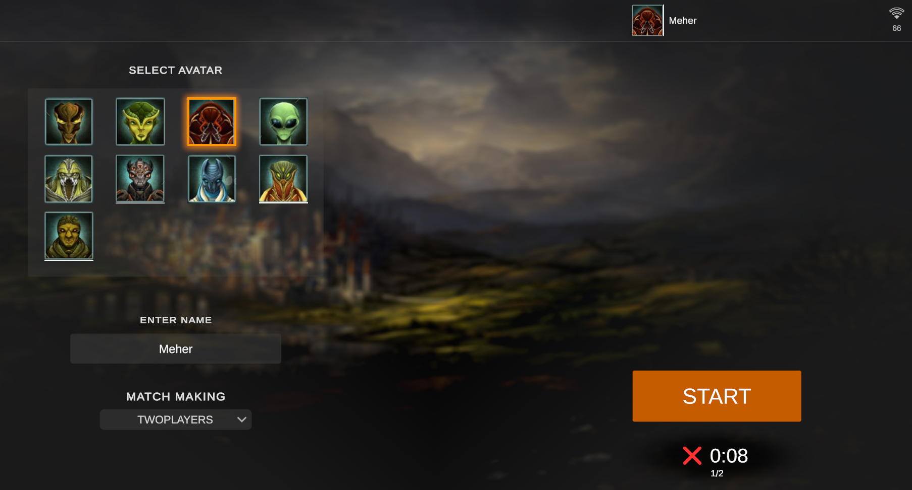
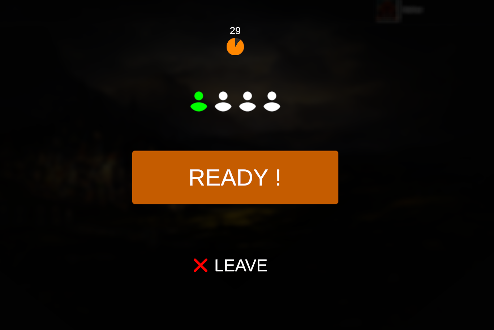
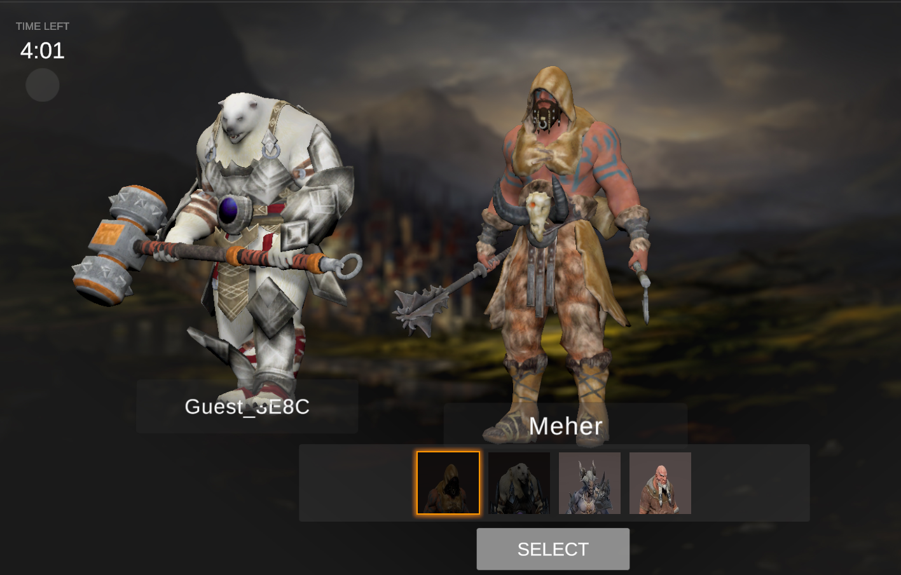
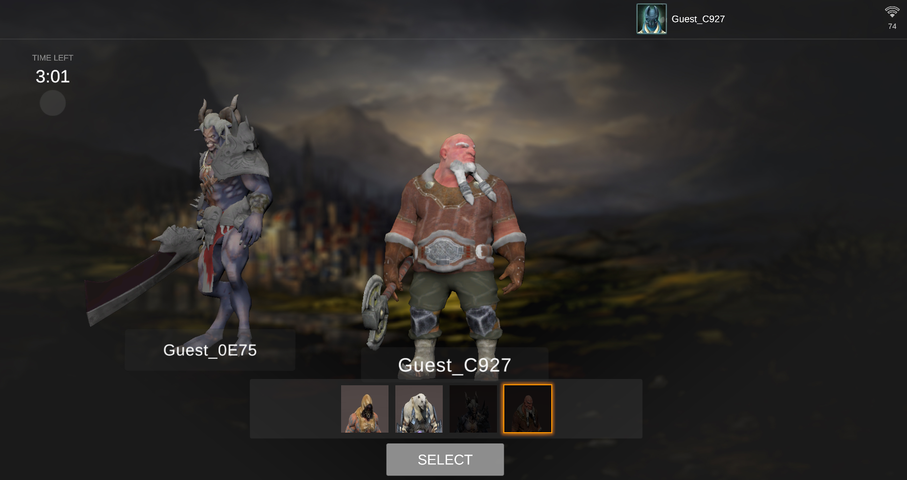
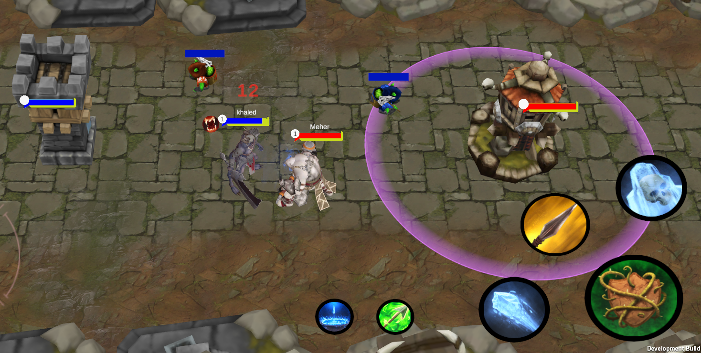
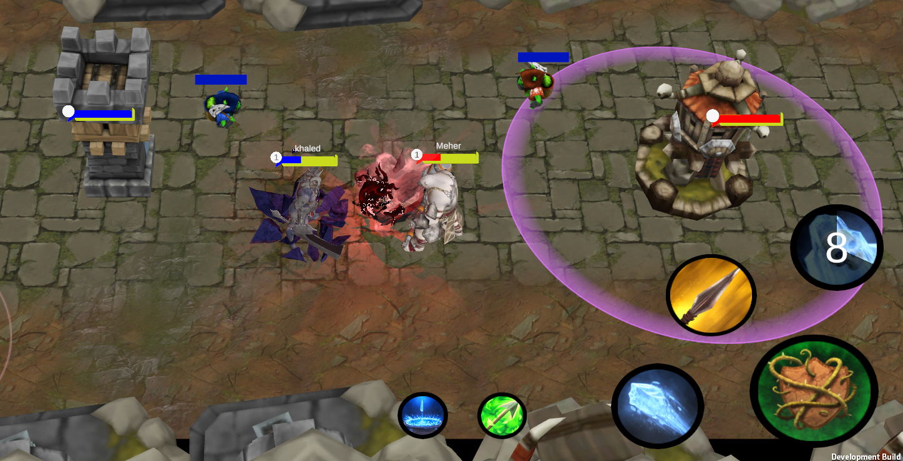

# Prototype MOBA Game (Unfinished)

https://www.youtube.com/watch?v=Q5lWyDzbtqw&ab_channel=MeherJouini

This repository contains the source code and assets for a prototype mobile MOBA (Multiplayer Online Battle Arena) game similar to Mobile Legends. The project is built using Unity and utilizes the Photon Networking framework for multiplayer functionality.

## Description
The goal of this project is to create a basic prototype of a MOBA game that runs on mobile devices. The game features two teams of players competing against each other in an online multiplayer battle. The core gameplay mechanics include selecting heroes, controlling units, battling enemy players, and destroying the opposing team's base.

**Please note that this project is unfinished and intended as a prototype to demonstrate gameplay mechanics and network integration.**

## Features
- Hero selection: Players can choose from a variety of heroes, each with unique abilities and playstyles.
- Online multiplayer: Connect with other players in real-time matches using Photon Networking.
- Skill system: Heroes have different skills and abilities that can be upgraded throughout the match.
- Tower defense: Protect your team's base while attempting to destroy the enemy's base.
- UI and HUD: Includes a user-friendly interface with essential information for players.

## Getting Started
To get started with the project, follow these steps:

1. Clone the repository to your local machine.
2. Open the project in Unity version X.X.X or later.
3. Ensure you have the necessary dependencies, including Photon Networking.
4. Explore the project assets, scenes, and scripts to understand the game mechanics and implementation.
5. Build and run the project on your desired platform (Android, iOS, etc.) for testing and gameplay.

## Dependencies
- Unity : [Unity Download](https://unity.com/)
- Photon Networking: [Photon Website](https://www.photonengine.com/)

## Contributing
Contributions to this project are currently not accepted as it is an unfinished prototype. However, feel free to fork the repository and make your modifications for personal or educational use.

## License
This project is licensed under the [MIT License](LICENSE). Feel free to use and modify the code for your own purposes.

## Acknowledgements
- [Unity](https://unity.com/) - Game development engine used for the project.
- [Photon Networking](https://www.photonengine.com/) - Network framework for multiplayer functionality.

## Contact
For any questions or inquiries, please contact [Meher Jouini](mailto:jouin.meherr@gmail.com).
